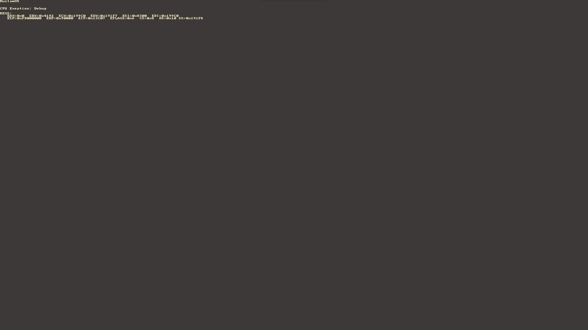

# ruslamOS


my hobby 32bit os written in rust


## TOOLS

* Nasm
* Qemu
* Cargo (rust stuff)
* Make


# build
```
make
```

# run
```
make run
```

make sure your build system run on unix-like operating system


## TODO LIST

- [ ] build fully working custom bootloader 
- [x] VGA
- [x] Vesa Video mode
- [ ] Kernel
- [ ] Memory managment Paing and heap ...
- [ ] Sound Keyboard etc.
- [ ] ACPI driver 
- [ ] SATA driver
- [ ] FileSystem
- [ ] Window Manager
- [ ] IDE 
- [ ] Some default applications paint, calculator, calender, clock, photo, music player etc...
- [ ] Write a compiler for my custom language Rusty-C
- [ ] Porting DOOM or Wolfenstein 3D for RuslamOS (wishlist)
- [ ] Re-Write entire RuslamOS in Rusty-C (also wishlist)